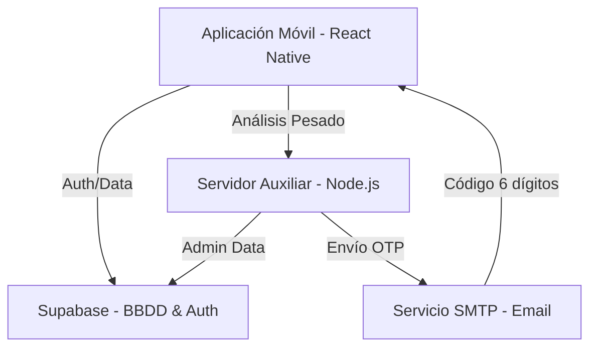

# LUMEX: Bioanalítica de Precisión
## Documentación Integral del Proyecto

---

## 1. Introducción
**LUMEX** es una plataforma tecnológica avanzada diseñada para el monitoreo integral y personalizado del bienestar humano a través de la bioanalítica de precisión. La aplicación permite a los usuarios cargar conjuntos de datos biomédicos, analizarlos mediante modelos de inteligencia artificial y recibir reportes detallados sobre anomalías o estados de riesgo clínico.

El proyecto está diseñado con una arquitectura escalable que separa la gestión de datos (Supabase), el procesamiento pesado (Servidor Node.js) y la experiencia de usuario (React Native).

---

## 2. Arquitectura del Sistema

El ecosistema de LUMEX se compone de tres capas principales:

### 2.1 Frontend (Aplicación Móvil)
- **Tecnología**: React Native con Expo.
- **Propósito**: Interfaz de usuario intuitiva y de alto rendimiento.
- **Características Clave**: 
    - Diseño premium con estética minimalista y moderna (colores teal y dark blue).
    - Soporte multi-idioma (i18next).
    - Navegación optimizada para diferentes roles (Paciente y Administrador).

### 2.2 Backend (Servidor Auxiliar)
- **Tecnología**: Node.js + Express.
- **Archivo Principal**: `server.js`
- **Funciones Críticas**:
    - **Procesamiento de Análisis**: Realiza cálculos de detección de anomalías (Z-Score) y preparación de resultados para el almacenamiento masivo.
    - **Gestión de Recuperación**: Envío de correos OTP para restablecimiento de contraseñas.
    - **Operaciones Administrativas**: Eliminación segura de usuarios y gestión de integridad.

### 2.3 Base de Datos y Servicios (Supabase)
- **Tecnología**: Postgres (Relacional) + Auth + RLS (Seguridad a nivel de fila).
- **Propósito**: Persistencia de datos en tiempo real y gestión de seguridad.

---

## 3. Módulos Funcionales

### 3.1 Autenticación y Seguridad
- **Registro/Login**: Gestión centralizada a través de Supabase Auth.
- **Roles**: 
    - **Administrador**: Gestión total del ecosistema clínica.
    - **Paciente/Usuario**: Acceso a sus propios análisis y reportes.
- **Recuperación**: Proceso seguro mediante código de 6 dígitos (OTP) enviado por correo electrónico.

### 3.2 Motor de Análisis (Bioanalítica)
Este es el corazón de LUMEX. Permite transformar datos crudos en información accionable.
- **Carga de Datos**: Soporte para archivos CSV.
- **Análisis de Anomalías**: Identificación de registros fuera de los rangos normales utilizando métricas de error de reconstrucción y Z-score.
- **Reportes Detallados**: Visualización de anomalías, métricas de precisión y resultados por cada registro analizado.

### 3.3 Panel Administrativo
Una herramienta poderosa para la gestión clínica:
- **Gestión de Pacientes**: Creación, edición y monitoreo de usuarios registrados.
- **Historial de Pagos**: Visualización agrupada por usuario de todas las transacciones financieras.
- **Alertas del Sistema**: Monitoreo de riesgos críticos y fallos técnicos basados en la integridad de los datos.

### 3.4 Pasarela de Pagos (Créditos)
LUMEX utiliza un modelo de monetización basado en créditos.
- **Adquisición**: Los usuarios compran créditos para realizar análisis nuevos.
- **Flujo**: Selección de plan -> Simulación de pago seguro -> Registro de transacción en Supabase -> Asignación de créditos automática.

---

## 4. Estructura de Datos (Tablas Clave)

| Tabla | Propósito |
| :--- | :--- |
| `usuarios` | Almacena perfiles, nombres, correos y roles. |
| `analisis` | Cabecera de cada ejecución de análisis realizada. |
| `resultados` | Datos atómicos de cada fila analizada (anomalías, errores). |
| `datasets` | Referencias a los archivos cargados por el usuario. |
| `modelos` | Información sobre los algoritmos de IA utilizados. |
| `pagos` | Registro de transacciones financieras y créditos adquiridos. |

---

## 5. Diagramas de Flujo

### Arquitectura General


---

## 6. Configuración Desarrollador
Para ejecutar el proyecto localmente, es necesario configurar las variables de entorno en un archivo `.env` en la raíz:

```env
SUPABASE_URL=tu_url_supabase
SUPABASE_ANON_KEY=tu_anon_key
SUPABASE_SERVICE_ROLE_KEY=tu_service_key
PORT=3000
SMTP_HOST=tu_host_smtp
SMTP_PORT=587
SMTP_USER=tu_usuario
SMTP_PASS=tu_password
SMTP_FROM=Lumex <noreply@lumex.com>
```

---
**LUMEX - Bioanalítica de Precisión**
*© 2026 Todos los derechos reservados.*
